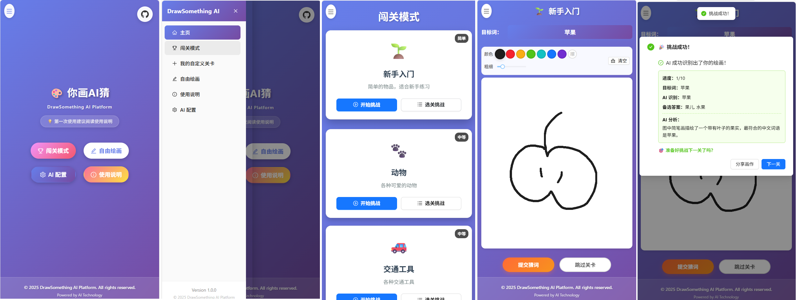

## 你好！👋

我是Liyulingyue，一个慵懒的开发者。欢迎来到我的GitHub主页！

## 关于我

- 🎂 1996年出生。
- 🧑‍🎓 2022年毕业于武汉某校，研究方向为群优化算法。
- 🚣‍♂ 飞桨开发者技术专家，PaddlePaddle 仓库 Committer，给 Paddle 仓库提供了一些代码贡献。
- ⌨️ 持续活跃在 [AiStudio](https://aistudio.baidu.com/personalcenter/thirdview/608082)，分享自己的开发内容。
- 👯 欢迎合作和贡献开源项目。

## 技术栈

   
   
   
   
   

## 开发环境

   
   

## 我的项目

这里是一些我正在开发的项目：

1. [DrawSomethingAIPlatform](https://github.com/Liyulingyue/DrawSomethingAIPlatform)
   - 这是一个你画AI猜的小游戏，进入游戏后，你需要绘制指定词语对应的画面，AI猜中即过关。部署后，PAD竖屏使用可以获得最佳体验。
   

2. [PaddleGames](https://github.com/Liyulingyue/PaddleGames)
   - 这是我很早之前开启的仓库，后来逐渐遗忘和放置了。该仓库希望构建一整套基于深度学习的小游戏。

     
     
## 一些我很满意的贡献

1. 2025/2/6 进行 PaddleSpeech 的依赖治理，从而支持用户成功基于源码对 paddlespeech 进行安装。

感谢你的访问！希望你能喜欢我的项目和分享的内容。

## 编程语言

